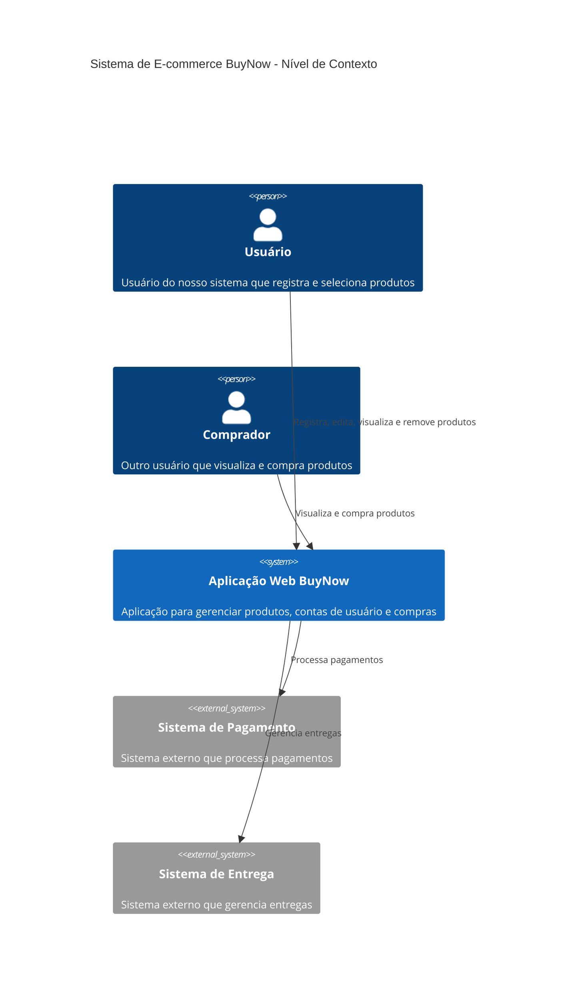
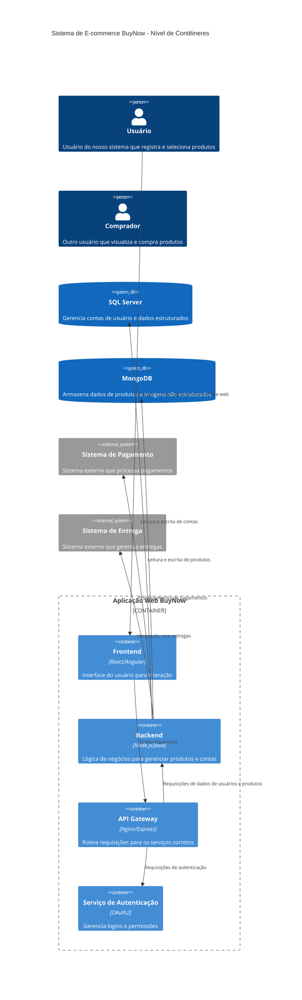
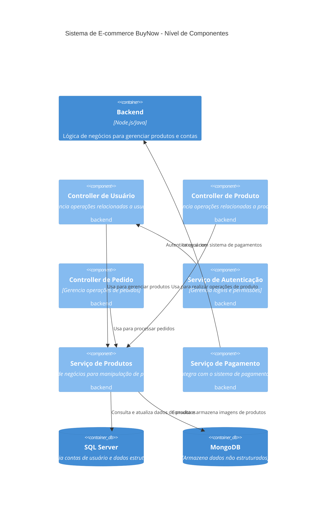
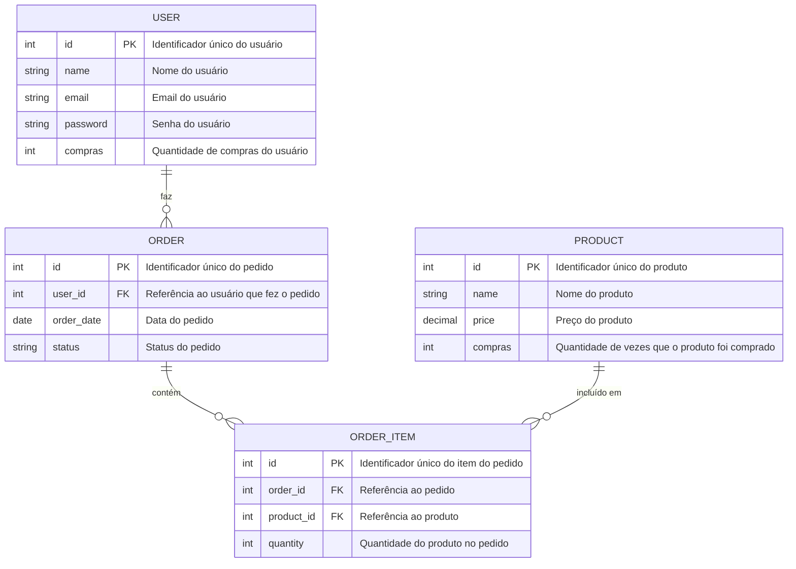

# BuyNow - Sistema de E-commerce

## 1. Introdução e Objetivo

Nosso sistema tem como objetivo registro e compra de produtos, foi desenvolvido para permitir que os usuários possam criar contas, registrar produtos para venda, editar e visualizar os produtos registrados, além de remover produtos quando necessário. Outros usuários podem visualizar esses produtos e realizar a compra de forma eficiente. O objetivo principal é proporcionar uma plataforma integrada e intuitiva que facilite a compra e venda de produtos entre usuários.

## 2. Restrições Arquiteturais

- **Tecnologias Utilizadas**: O sistema deve utilizar SQL Server para gerenciar os dados estruturados, como todo o registros de contas. O MongoDB será utilizado para armazenar dados não estruturados, como os produtos, imagens dos produtos e suas descrições.
- **Integrações**: A aplicação deve se integrar com sistemas bancários externos para processar pagamentos de maneira segura e confiável.

## 3. Contexto

O sistema de e-commerce BuyNow é uma aplicação que permite que usuários registrem e selecionem produtos desejados, criem cadastros e anunciem produtos. Ele se comunica com bancos para coleta de informações dos produtos e das contas, o pagamento e a entrega é realizado de forma externa.

### C4 Model - Level 1: Diagrama de Contexto

### C4 Model - Level 2: Diagrama de Contêineres:

### C4 Model - Level 3: Diagrama de Componentes:

## 4. Visão Geral da Solução 

- **4.1 Escopo da Solução**: A solução é composta por um sistema de e-commerce com funcionalidades CRUD para usuários e produtos, utilizando Flask para o back-end e HTML para renderização de templates. O sistema de banco de dados é gerenciado pelo MySQL. 

- **4.2 Componentes Principais**: 

    - **API Gateway**: Ponto de entrada único de requisições para o sistema.

    - **BFF**: Serviço que lida com as requisições HTTP e envia a requisição para o serviço solicitado. 

    - **Microsserviço**: Serviço desenvolvido em Python utilizando a biblioteca Flask, que é responsável pelo gerenciamento de usuários. 

    - **MySQL**: Banco de dados relacional usado para persistência de dados dos usuários. 

    - **Azure Functions**: Serviço desenvolvido em node.js para execução de funções com CRUD de produtos. 

    - **MongoDB**: Banco de dados não relacional usado para persistência de dados dos produots. 

    - **Docker**: Empacotamento da aplicação em um container para facilitar a implantação. 

## 5. Decisões de Design 

- **5.1 Banco de Dados Relacional**: Decidimos utilizar MySQL como banco de dados relacional para gerenciar os dados estruturados de usuários. O MySQL oferece consistência e facilidade de integração com Flask, sendo também compatível com Azure. 

- **5.2 Serviço em Nuvem**: A aplicação foi desenvolvida para operar na nuvem, permitindo escalabilidade e resiliência. 

- **5.3 Empacotamento com Docker**: A solução utiliza Docker para encapsular a aplicação e suas dependências, facilitando a portabilidade entre ambientes e garantindo consistência de funcionamento. 

- **5.4 Segurança**: Utilização de uma chave secreta para gerenciamento de sessões no Flask e variáveis de ambiente para conexão segura com o banco de dados. 

## 6. Qualidade e Requisitos Não Funcionais 

- **6.1 Escalabilidade**: O sistema deve ser capaz de suportar um aumento significativo no número de usuários e produtos, mantendo o desempenho adequado, especialmente durante picos de uso, como promoções ou eventos sazonais

- **6.2 Disponibilidade**: O sistema deve garantir um tempo de inatividade mínimo para que os usuários possam acessar a plataforma 24/7, considerando tolerância a falhas e recuperação rápida em caso de problemas.

- **6.3 Desempenho**: O sistema deve oferecer respostas rápidas e uma experiência fluida, com tempos de carregamento otimizados, para garantir a satisfação e retenção dos usuários.

- **6.4 Segurança**: A segurança é tratada por meio de chaves secretas no Flask e conexão segura com o banco de dados MySQL. 

- **6.5 Manutenibilidade**: O uso de padrões claros no código, como separação de camadas e o uso de Docker, facilita a manutenção e atualização da aplicação. 

## 7. Estrutura 

- **7.1 Organização dos Componentes**: A aplicação é organizada em três camadas principais: 

    - **Camada de Apresentação**: Template HTML que lida com a interface do usuário. 

    - **Camada de Aplicação**: Implementada com Flask, lidando com as rotas HTTP e validação de dados. 

    - **Camada de Persistência**: Gerenciada pelo SQLAlchemy, que se conecta ao MySQL. 

- **7.2 Padrões Arquiteturais**: A aplicação segue o padrão MVC (Model-View-Controller), onde: 

        -Modelos representam os dados (Usuário, Produto)

        -Views representam a interface (HTML renderizado)

        -Controladores lidam com a lógica de negócios e roteamento (Flask)

## 8. Implantação 

- **8.1 Estratégia de Implantação**: A aplicação é implantada em um ambiente em nuvem (Azure). A Dockerização do microsserviço e do BFF garante que a aplicação funcione de maneira consistente em qualquer ambiente. 

- **8.2 Infraestrutura**: 

    - **Banco de Dados**: MySQL e MongoDB na nuvem (Azure).

    - **Aplicação**: Azure Functions gerencia o CRUD dos produtos, e o microsserviço executa as funcionalidades de usuário. 

- **8.3 Monitoramento**: O sistema de monitoramento é configurado no arquivo JSON da Azure Functions, com logging ativado para rastrear erros e monitorar desempenho. 

## 9. Visão de Crosscutting 

- **9.1 Segurança**: Todas as rotas da aplicação Flask utilizam variáveis de ambiente para garantir a proteção de credenciais. 

- **9.2 Logging e Monitoramento***: A aplicação utiliza o serviço de monitoramento do Azure para registrar erros e eventos, garantindo que problemas sejam identificados rapidamente. 

## 10. Qualidade Técnica 

- **10.1 Princípios Técnicos**: O código foi desenvolvido seguindo boas práticas, como: 

    - Manter as rotas e controladores simples e separados das camadas de apresentação. 

    - Utilização de Docker para garantir consistência nos ambientes. 

- **10.2 Padrões de Código**: A aplicação segue padrões de código limpos, com variáveis nomeadas de maneira intuitiva e separação clara de responsabilidades entre os modelos, controladores e templates. 

## 11. Riscos e Ameaças 

- **11.1 Riscos Técnicos**: 

    - **Dependência de Banco de Dados Relacional**: O sistema depende fortemente do MySQL para a persistência de dados. Caso o banco de dados fique indisponível, a aplicação não poderá funcionar corretamente. 

- **11.2 Ameaças à Segurança**: 

    - **Exposição de Credenciais**: A configuração da aplicação utiliza variáveis de ambiente para mitigar o risco de exposição de senhas ou chaves API, mas isso precisa ser monitorado de perto. 

    - **Injeção de SQL**: Embora o SQLAlchemy proteja contra injeção de SQL, é importante continuar monitorando e validando todas as entradas de usuários 

- **11.3 Cenários ATAM**:

    -**Cenário 1: Confiabilidade do Sistema de Pagamento Externo**:

    -Descrição: O sistema depende de um serviço externo de pagamento. Caso o sistema de pagamento esteja fora do ar ou instável, as transações podem falhar, afetando a experiência do usuário e a confiabilidade da plataforma.

    -Ameaças: Indisponibilidade e falhas na transação.

    Mitigação: Implementação de mecanismos de fallback e filas para reprocessamento em caso de falha de pagamento.

    -**Cenário 2: Escalabilidade da Base de Dados de Produtos**:

    -Descrição: À medida que o volume de produtos aumenta, a base de dados NoSQL que armazena dados de produtos deve continuar performando de forma eficiente.

    -Ameaças: Degradação de performance em consultas e aumento no tempo de resposta.

    -Mitigação: Monitoramento da performance e planejamento de estratégias de sharding ou particionamento para garantir a escalabilidade.

    -**Cenário 3: Vazamento de Dados do Usuário**:

    -Descrição: Dados de usuários e informações de pagamento são alvos sensíveis. Qualquer exposição poderia comprometer a segurança da aplicação.

    -Ameaças: Acesso não autorizado a dados sensíveis.

    -Mitigação: Criptografia dos dados sensíveis, controle de acesso rigoroso e uso de variáveis de ambiente para chaves secretas.

## Diagrama de Entidade e Relacionamento

### Endereços do Backend e Funções
### Backend

-**REQUISIÇOES BFF**

    -GET https://buynow-bff.blackcliff-7d1a3af3.eastus2.azurecontainerapps.io/api/products

    -GET https://buynow-bff.blackcliff-7d1a3af3.eastus2.azurecontainerapps.io/api/users

    -POST https://buynow-bff.blackcliff-7d1a3af3.eastus2.azurecontainerapps.io/api/products

    {
     "name": "Nome do Produto",
     "description": "Descrição"
    }

    -POST https://buynow-bff.blackcliff-7d1a3af3.eastus2.azurecontainerapps.io/api/users

    {
     "username": "Nome de Usuário",
     "password": "Senha"
    }

    -POST https://buynow-bff.blackcliff-7d1a3af3.eastus2.azurecontainerapps.io/api/users/{id}/comprar

    {
      "product_id": {id},
    }

    -PUT https://buynow-bff.blackcliff-7d1a3af3.eastus2.azurecontainerapps.io/api/products/{id}

    {
     "name": "Nome do Produto",
     "description": "Descrição"
    }

    (pode ser qualquer campo)

    -PUT https://buynow-bff.blackcliff-7d1a3af3.eastus2.azurecontainerapps.io/api/users/{id}

    {
      "username": "Nome de Usuário",
      "senha": "Senha"
    }

    (pode ser qualquer campo)

    -DELETE https://buynow-bff.blackcliff-7d1a3af3.eastus2.azurecontainerapps.io/api/products/{id}

    -DELETE https://buynow-bff.blackcliff-7d1a3af3.eastus2.azurecontainerapps.io/api/users/{id}

-**REQUISIÇOES FUNCTIONS (PRODUCTS)**

    -GET https://buynow-bff.blackcliff-7d1a3af3.eastus2.azurecontainerapps.io/api/products

    -POST https://buynow-bff.blackcliff-7d1a3af3.eastus2.azurecontainerapps.io/api/products

    {
     "name": "Nome do Produto",
     "description": "Descrição"
    }
    -PUT https://buynow-bff.blackcliff-7d1a3af3.eastus2.azurecontainerapps.io/api/products/{id}

    {
     "name": "Nome do Produto",
     "description": "Descrição"
    }

    (pode ser qualquer campo)

    -DELETE https://buynow-bff.blackcliff-7d1a3af3.eastus2.azurecontainerapps.io/api/products/delete

-**REQUISICOES MICROSSERVICO (USERS)**

    -GET https://buynow-users.blackcliff-7d1a3af3.eastus2.azurecontainerapps.io/api/users

    -POST https://buynow-users.blackcliff-7d1a3af3.eastus2.azurecontainerapps.io/api/users

    {
     "username": "Nome de Usuário",
     "password": "Senha"
    }

    -POST https://buynow-users.blackcliff-7d1a3af3.eastus2.azurecontainerapps.io/api/users/{id}/comprar

    {
     "product_id": {id}
    }

    -PUT https://buynow-users.blackcliff-7d1a3af3.eastus2.azurecontainerapps.io/api/users/{id}

    {
     "username": "Nome de Usuário",
     "password": "Senha"
    }

    (pode ser qualquer campo)

    -DELETE https://buynow-users.blackcliff-7d1a3af3.eastus2.azurecontainerapps.io/api/users/{id}

-**REQUISIÇOES API GATEWAY**

    -GET https://ck0rrle2y1.execute-api.eu-north-1.amazonaws.com/api/products

    -GET https://ck0rrle2y1.execute-api.eu-north-1.amazonaws.com/api/users

    -POST https://ck0rrle2y1.execute-api.eu-north-1.amazonaws.com/api/products

    {
     "name": "Nome do Produto",
     "description": "Descrição"
    }

    -POST https://ck0rrle2y1.execute-api.eu-north-1.amazonaws.com/api/users

    {
     "username": "Nome de Usuário",
     "password": "Senha"
    }

    -POST https://ck0rrle2y1.execute-api.eu-north-1.amazonaws.com/api/users/{id}/comprar

    {
     "product_id": {id},
    }

    -PUT https://ck0rrle2y1.execute-api.eu-north-1.amazonaws.com/api/products/{id}

    {
     "name": "Nome do Produto",
     "description": "Descrição"
    }

    (pode ser qualquer campo)

    -PUT https://ck0rrle2y1.execute-api.eu-north-1.amazonaws.com/api/users/{id}

    {
     "username": "Nome de Usuário",
     "senha": "Senha"
    }

    (pode ser qualquer campo)

    -DELETE https://ck0rrle2y1.execute-api.eu-north-1.amazonaws.com/api/products/{id}

    -DELETE https://ck0rrle2y1.execute-api.eu-north-1.amazonaws.com/api/users/{id}